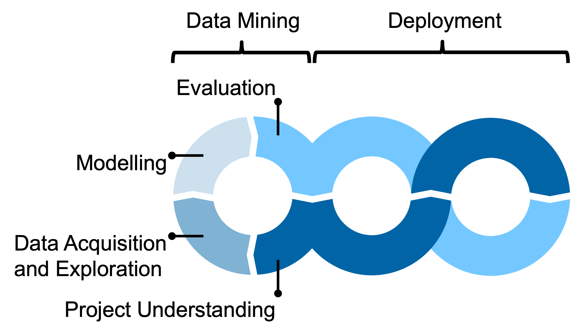

# Sample Project
Change `sample` to the respective project name in

* filename of .yml file
* environment name in .yml-file
* in the commands below

Adapted the `LICENSE` as required.

Provide a brief description of the project here.

## Project Organisation
According to [Is It Ops That Make Data Science Scientific? Archives of Data Science, Series A, vol 8, p. 12, 2022.](https://publikationen.bibliothek.kit.edu/1000150238/152958955)



Code and configurations used in the different project phases are stored in the subfolders

* `data_acquisition`
* `eda`
* `modelling`
* `deployment`

Templates for the documentation artefacts from the different project phases are provided in the subfolder `docs` in the form of a Quarto project:

* Project charta
* Data report
* Modelling report
* Evaluation decision log

See section `Quarto Setup and Usage` for instructions on how to build and serve the documentation website from the indvidual reports using Quarto.

Simple Markdown-Templates are provided as an alternative in `docs/md-templates` - remove if not needed.

## Python Environment Setup and Management
**Install** conda environment:
```sh
$ conda env create -f conda.yml
```
**Update** the environment with new packages/versions:
1. modify template.yml
2. run `conda env update`:
```sh
$ conda env update --name sample --file conda.yml --prune
```
`prune` uninstalls dependencies which were removed from sample.yml

**Use** environment:
before working on the project always make sure you have the environment activated:
```sh
$ conda activate sample
```

**Check the version** of a specific package (e.g. `html5lib`) in the environment:
```sh
$ conda list html5lib
```

**Export** an environment file across platforms:
Include only the packages that were specifically installed. Dependencies will be resolved upon installation
```sh
$ conda env export --from-history > conda.yml
```

**List** all installed environments:
From the base environment run
```sh
$ conda info --envs
```

**Remove** environment:
```sh
$ conda env remove -n sample
```

See the complete documentation on [managing conda-environments](https://docs.conda.io/projects/conda/en/latest/user-guide/tasks/manage-environments.html).

## Runtime Configuration with Environment Variables
The environment variables are specified in a .env-File, which is never commited into version control, as it may contain secrets. The repo just contains the file `.env.template` to demonstrate how environment variables are specified.

You have to create a local copy of `.env.template` in the project root folder and the easiest is to just rename it to `.env`.

The content of the .env-file is then read by the pypi-dependency: `python-dotenv`. Usage:
```python
import os
from dotenv import load_dotenv
```

`load_dotenv` reads the .env-file and sets the environment variables:

```python
load_dotenv()
```

which can then be accessed (assuming the file contains a line `SAMPLE_VAR=<some value>`):

```python
os.environ['SAMPLE_VAR']
```

## Quarto Setup and Usage
If Quarto is used to build a documentation website as described in the subsequention section (Project Organisation), then you need to 

1. [Install Quarto](https://quarto.org/docs/get-started/)
2. Optional: [quarto-extension for VS Code](https://marketplace.visualstudio.com/items?itemName=quarto.quarto)
3. Adapt the configuration file `docs/_quarto.yml` as needed.
4. Build the website by running `quarto render` from the `docs` subfolder. This will push all files into the `docs/build` subfolder.
5. The you can check the website locally by opening `docs/build/index.html` in a browser

If you would like to use github pages to serve the documentation website, and at the same time avoid pushing the rendered files into the repo (makes very ugly diffs) but executing embedded code blocks only locally, the initial setup (only needed once) of the github action is according to https://quarto.org/docs/publishing/github-pages.html#github-action as follows: 

1. Add 
    ```yaml
        execute:
            freeze: auto
    ```
    to the `_quarto.yml` file
2. execute `quarto render` from the `docs` folder
3. run `quarto publish gh-pages` (generates and pushes a branch called `gh-pages`)
4. make sure that github pages is configured to serve the root of the `gh-pages` branch
4. add the definition of the action `.github/workflows/publish.yml` (see below)
5. check all of the newly created files (including the `_freeze` directory) into the `main` branch of the repository 
6. `docs/build` is excluded by the `.gitignore`
7. then push to `main`

`.github/workflows/publish.yml`:
```yaml
on:
  workflow_dispatch:
  push:
    branches: main

name: Quarto Publish

jobs:
  build-deploy:
    runs-on: ubuntu-latest
    permissions:
      contents: write
    steps:
      - name: Check out repository
        uses: actions/checkout@v4
    
      - name: Install librsvg
        run: sudo apt-get install librsvg2-bin

      - name: Set up Quarto
        uses: quarto-dev/quarto-actions/setup@v2
        with:
          tinytex: true

      - name: Render and Publish
        uses: quarto-dev/quarto-actions/publish@v2
        with:
          target: gh-pages
          path: docs
        env:
          GITHUB_TOKEN: ${{ secrets.GITHUB_TOKEN }}
```

From now on, every update just needs:

1. Build the website by running `quarto render` from the `docs` subfolder. This will push the rendered files into `docs/build` (not checked into the repository via .gitignore) and computations in the `docs/_freeze` (checked in so that github action runners to not need python) subfolder.
2. Check the website locally by opening the  `docs/build/index.html`
3. Push all updated files into the `main` branch. This will trigger a github action that
    - pushes an update to the `github-pages` branch
    - renders and publishes the site to https://<your user handle>.github.io/sample/

## Further Information
* "About Readmes" on Github
https://docs.github.com/en/repositories/managing-your-repositorys-settings-and-features/customizing-your-repository/about-readmes
* [Python Dev Guide](refs/python_dev_guide.md)